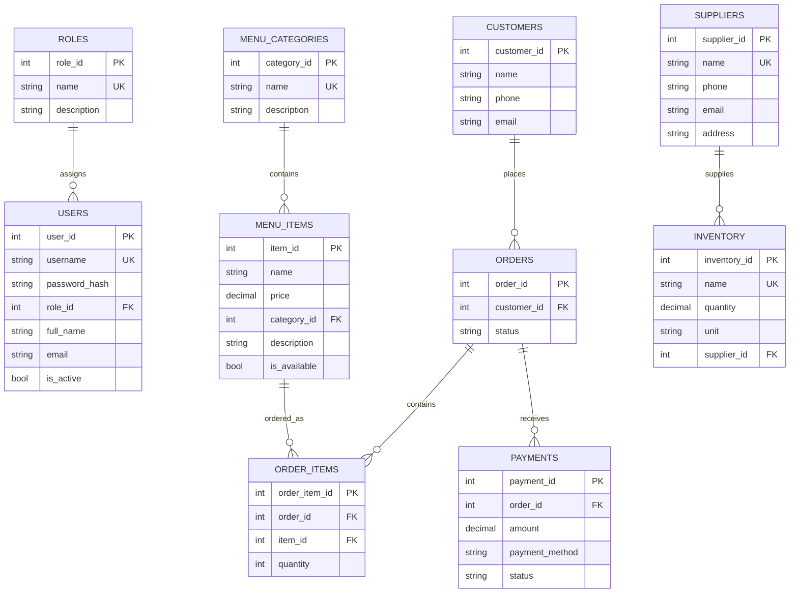

# RMS Entity Relationship Diagram

```mermaid
erDiagram
    ROLES ||--o{ USERS : assigns
    MENU_CATEGORIES ||--o{ MENU_ITEMS : contains
    CUSTOMERS ||--o{ ORDERS : places
    ORDERS ||--o{ ORDER_ITEMS : contains
    MENU_ITEMS ||--o{ ORDER_ITEMS : ordered_as
    ORDERS ||--o{ PAYMENTS : receives
    SUPPLIERS ||--o{ INVENTORY : supplies

    ROLES {
        int role_id PK
        string name UK
        string description
    }
    USERS {
        int user_id PK
        string username UK
        string password_hash
        int role_id FK
        string full_name
        string email
        bool is_active
    }
    MENU_CATEGORIES {
        int category_id PK
        string name UK
        string description
    }
    MENU_ITEMS {
        int item_id PK
        string name
        decimal price
        int category_id FK
        string description
        bool is_available
    }
    CUSTOMERS {
        int customer_id PK
        string name
        string phone
        string email
    }
    ORDERS {
        int order_id PK
        int customer_id FK
        string status
    }
    ORDER_ITEMS {
        int order_item_id PK
        int order_id FK
        int item_id FK
        int quantity
    }
    PAYMENTS {
        int payment_id PK
        int order_id FK
        decimal amount
        string payment_method
        string status
    }
    SUPPLIERS {
        int supplier_id PK
        string name UK
        string phone
        string email
        string address
    }
    INVENTORY {
        int inventory_id PK
        string name UK
        decimal quantity
        string unit
        int supplier_id FK
    }
```
