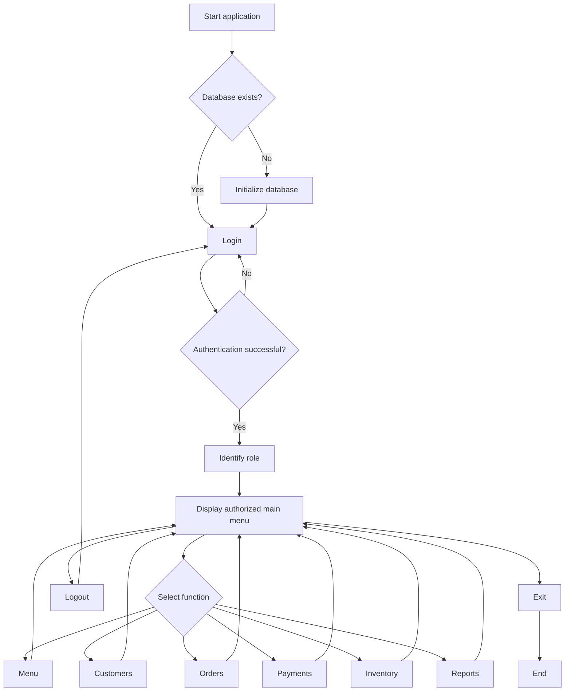
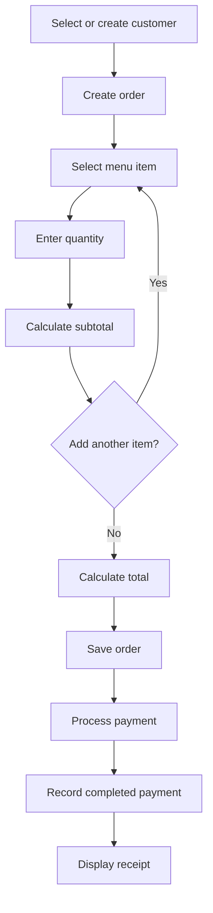
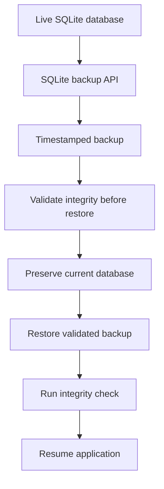

# RMS Flowcharts

## Application flow

```mermaid
flowchart TD
    A[Start application] --> B{Database exists?}
    B -- No --> C[Initialize database]
    B -- Yes --> D[Login]
    C --> D
    D --> E{Authentication successful?}
    E -- No --> D
    E -- Yes --> F[Identify role]
    F --> G[Display authorized main menu]
    G --> H{Select function}
    H --> I[Menu]
    H --> J[Customers]
    H --> K[Orders]
    H --> L[Payments]
    H --> M[Inventory]
    H --> N[Reports]
    I --> G
    J --> G
    K --> G
    L --> G
    M --> G
    N --> G
    G --> O[Logout]
    O --> D
    G --> P[Exit]
    P --> Q[End]
```

## Order-to-payment flow

```mermaid
flowchart TD
    A[Select or create customer] --> B[Create order]
    B --> C[Select menu item]
    C --> D[Enter quantity]
    D --> E[Calculate subtotal]
    E --> F{Add another item?}
    F -- Yes --> C
    F -- No --> G[Calculate total]
    G --> H[Save order]
    H --> I[Process payment]
    I --> J[Record completed payment]
    J --> K[Display receipt]
```

## Backup and recovery flow

```mermaid
flowchart TD
    A[Live SQLite database] --> B[SQLite backup API]
    B --> C[Timestamped backup]
    C --> D[Validate integrity before restore]
    D --> E[Preserve current database]
    E --> F[Restore validated backup]
    F --> G[Run integrity check]
    G --> H[Resume application]
```
